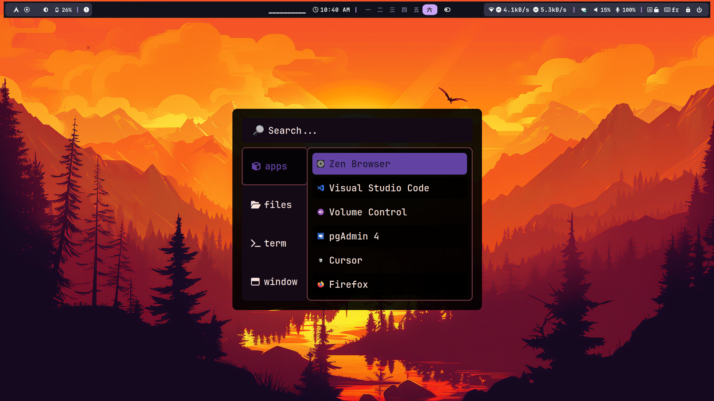
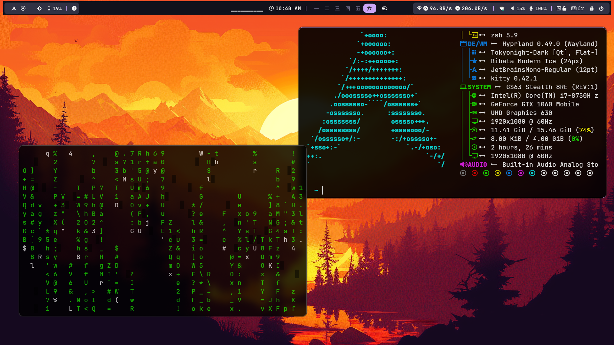

# ✨ My Hyprland Config ✨
#### ⭐ If this helps you, please leave a star ⭐

## 

##

##

##

##

A beautiful, feature-rich Hyprland configuration with modern aesthetics and smooth animations. This setup includes carefully curated themes, scripts, and configurations for a premium Linux desktop experience.

> 🙏 **Special Thanks**: This configuration is built upon the excellent work by [JaKooLit](https://github.com/JaKooLit). Check out their repository for more amazing Hyprland configurations!

## ✨ Features

- 🎨 **Beautiful Themes**: Dark/Light mode support with multiple color schemes
- 🎵 **Media Integration**: Rofi-based music player with online stations support
- 📱 **Modern UI**: Clean notification system with SwayNC
- 🎮 **Gaming Mode**: Toggle for optimal gaming performance
- 🖼️ **Wallpaper Effects**: Dynamic wallpaper management with wallust
- ⌨️ **Smart Keybindings**: Intuitive shortcuts and quick settings menu
- 📊 **System Monitoring**: Built-in system update and monitoring scripts
- 🔧 **Easy Customization**: User-friendly configuration management

## 📦 What's Included

- **Hyprland**: Window manager configuration with animations
- **Waybar**: Status bar with custom modules
- **Rofi**: Application launcher and various menus (emoji picker, music player, etc.)
- **SwayNC**: Notification daemon with custom styling
- **Kitty**: Terminal emulator configuration
- **Neovim**: Enhanced text editor setup with LazyVim
- **CAVA**: Audio visualizer integration

## 🚀 Quick Installation

### Prerequisites
Make sure you have the following installed:
- Hyprland
- Git
- Basic development tools
- [JaKooLit base config](https://github.com/JaKooLit/Arch-Hyprland)

### Installation Steps

1. **Clone the repository**
   ```bash
   git clone https://github.com/Fadilix/dotfiles
   cd dotfiles
   ```

2. **Make scripts executable**
   ```bash
   chmod +x install.sh restore.sh
   ```

3. **Install the configuration**
   ```bash
   ./install.sh
   ```

4. **Restore your previous config** (In case you wanna go back after installing my config)
   ```bash
   ./restore.sh
   ```

5. **Run the refresh command to apply the changes**
   ```bash
   ~/.config/hypr/scripts/Refresh.sh
   ```

### Configuration Management

Most user configurations can be found in:
- `~/.config/hypr/UserConfigs/` - User-specific settings
- `~/.config/hypr/UserScripts/` - Custom scripts

## 🛠️ Customization

### Themes
Multiple theme options are available. Use the quick settings menu to:
- Switch between dark/light modes
- Change Rofi themes
- Modify Kitty terminal themes
- Adjust monitor profiles

### Adding Your Own Scripts
Place custom scripts in `~/.config/hypr/UserScripts/` and they'll be integrated into the system.

## 🔧 Troubleshooting

### Common Issues

1. **Installation fails**: Make sure all dependencies are installed
2. **Themes not applying**: Try logging out and back in
3. **Scripts not working**: Check file permissions with `chmod +x`

### Getting Help

If you encounter issues:
1. Check the [Issues](https://github.com/Fadilix/dotfiles/issues) section
2. Review the original [JaKooLit repository](https://github.com/JaKooLit) for additional documentation
3. Open a new issue with detailed information about your problem

## 🤝 Contributing

Contributions are welcome! Feel free to:
- Report bugs
- Suggest new features
- Submit pull requests
- Share your customizations

## 🌟 Acknowledgments

- [JaKooLit](https://github.com/JaKooLit) - Original configuration and inspiration
- Hyprland community - For the amazing window manager
- All contributors to the various tools and themes used

---

**Enjoyed this configuration?** ⭐ Star this repository and follow for more awesome Linux setups!

